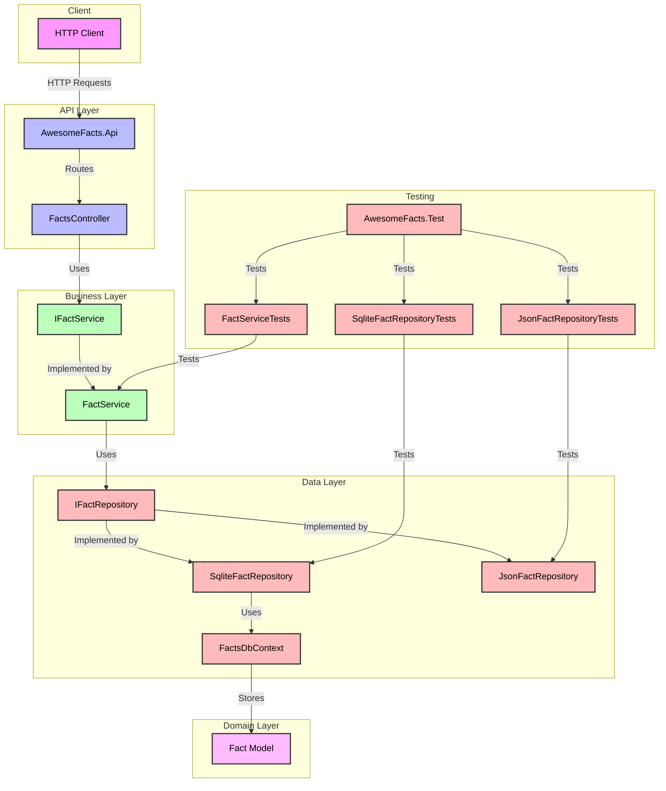

# Awesome Facts API Architecture

This diagram illustrates the structure and relationships between different components of the Awesome Facts API project.

## Project Structure Overview

The Awesome Facts API follows a clean architecture pattern with the following layers:

1. **API Layer** (`AwesomeFacts.Api`)
   - Handles HTTP requests and responses
   - Contains controllers and API endpoints
   - Manages routing and request/response formatting

2. **Business Layer** (`AwesomeFacts.Services`)
   - Contains business logic
   - Implements the `IFactService` interface
   - Orchestrates operations between API and data layers

3. **Data Layer** (`AwesomeFacts.Data`)
   - Manages data access and persistence
   - Implements the `IFactRepository` interface
   - Provides both SQLite and JSON storage implementations

4. **Domain Layer** (`AwesomeFacts.Models`)
   - Contains domain models and DTOs
   - Defines the core business entities

5. **Testing Layer** (`AwesomeFacts.Test`)
   - Contains unit tests for all layers
   - Tests service logic, repositories, and API endpoints
   - Includes test helpers and utilities

## Key Components

- **FactsController**: Handles HTTP requests for fact operations
- **FactService**: Implements business logic for fact management
- **IFactRepository**: Defines data access operations
- **SqliteFactRepository**: SQLite implementation of fact storage
- **JsonFactRepository**: JSON file implementation of fact storage
- **FactsDbContext**: Entity Framework Core context for SQLite
- **Fact Model**: Core domain model representing a fact

## Data Flow

1. Client sends HTTP request to API endpoint
2. Controller receives request and delegates to service
3. Service processes business logic and uses repository
4. Repository handles data persistence
5. Response flows back through the layers to client